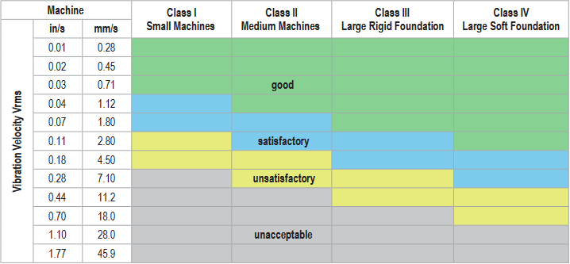
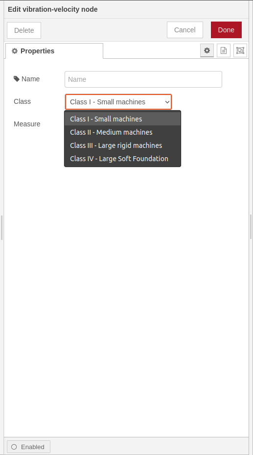
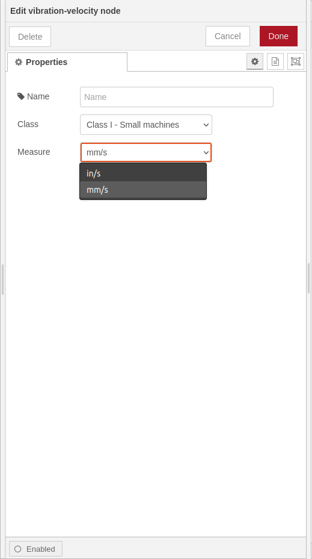
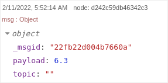
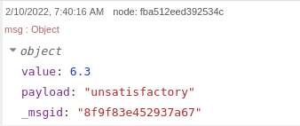
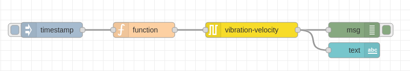

# node-red-contrib-vibration-severity
Node-RED node for evaluating vibration velocity severity based on ISO10816 guidance

## Install
You can install this nodes directly from the **Manage Palette** menu in the Node-RED interface.

Alternatively, run the following command in your Node-RED user directory - typically `~/.node-red` on Linux or `%HOMEPATH%\.nodered` on Windows

        npm node-red-contrib-vibration-severity

## How to use

### vibration-velocity
Use `vibration-velocity` to receive and evaluate RMS Velocity (Vrms) from vibration sensor to identify a problem of unbalaced load, misalignment, loose mounting, soft foot, etc.

This node receives as input `payload` the value of vibration characteristic to monitor and produces as output the state of the system.

## ISO 10816
**ISO 10816** provides guidance for evaluating vibration velocity severity motors, pumps, fans, compressors, gear boxes, blowers, dryers, presses and other machines that operate in the 10 to 1000 Hz frequency range.

## Usage

### Class

### Measure

### Input message object 

### Output message object 

### Sample flow

